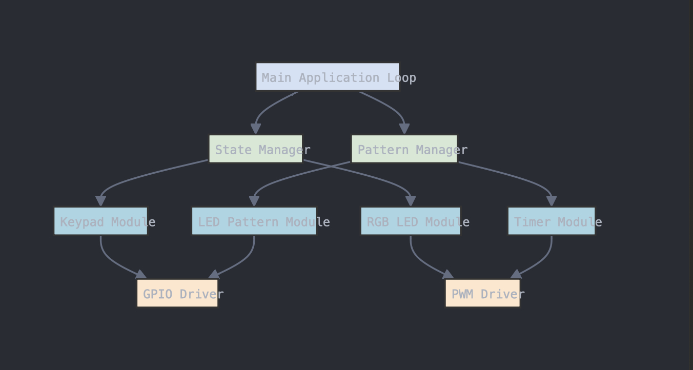

# EELE 465 Project 3

Template repository for project 3.

In this project, a keypad will be used to select from different time-varying patterns displayed on eight LEDs using your MSP430 and a breadboard. Patterns will be selected based on which button is pressed on your keypad. An unlock code will be required to begin the display of the LED patterns. An RGB LED will be used a status indicator.

## Flow Chart

## Circuit Diagram

## Software Architecture

## Unlocking Demo

[Video Title](https://www.youtube.com/shorts/PN20tyw8jiM)

